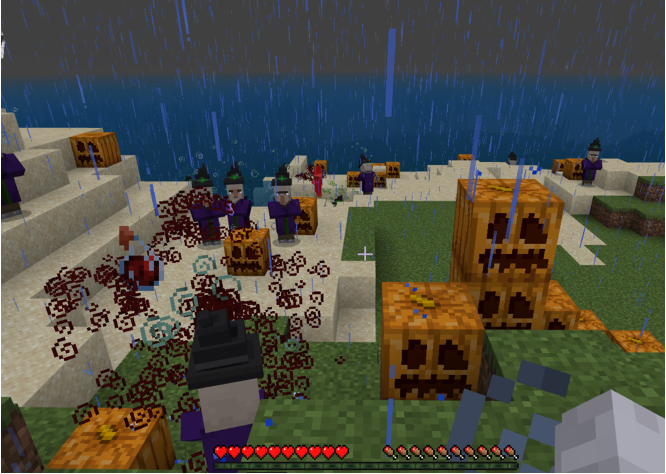

# Junior Engineers with Tony
{: .no_toc }

  

    Table of contents
  

  {: .text-delta }
1. TOC
{:toc}

---

## Enter the Kahoot quiz
Click on the button below to open **Kahoot** in a new tab.

<a href="https://kahoot.it" target="_blank"><button class="btn btn-purple">Open Kahoot</button></a>

{: .did-you-know}
Someone always asks what the game pin is, even though it's up on the screen.

---

## Sign in to Minecraft Education
Click your name to automagically copy your username.

  <button class="btn mr-4 mb-4" id="instructor15">Tony</button>
  <button class="btn mr-4 mb-4" id="junior168">Chi Dat 🥉 🎃</button>
  <button class="btn mr-4 mb-4" id="junior169">Minh Dat 🥇 🎃</button>
  <button class="btn mr-4 mb-4" id="junior170">Thomas 🥈 🎃</button>
  <button class="btn mr-4 mb-4" id="junior171">Tim</button>
  <!--
  <button class="btn mr-4 mb-4" id="junior172">Spare</button>
  -->

{: .selected-user}

None

Open **Minecraft Education**, paste in your username and type in the password (it's on the whiteboard)!

{: .did-you-know}
The shortcut for paste is **Control + V**

---

## Variables

<iframe width="560" height="315" src="https://www.youtube.com/embed/pNJi3S4G04w?t=3" title="YouTube video player" frameborder="0" allow="accelerometer; autoplay; clipboard-write; encrypted-media; gyroscope; picture-in-picture" allowfullscreen></iframe>

---

## Today's Activity
In the spirt of Halloween, we're going to be making a survival game featuring
player levels!

---

## Today's Challenges

### Challenge 1 (Easy)
Set the spawn point for everyone in a safe zone where they can get ready with armour and weapons.

{: .hint}
Use /setworldspawn

### Challenge 2 (Medium)
Output an additional message if the player reaches a certain level. For example, say "[player name] is legendary!" when the player reaches Level 20.

{: .hint}
You'll need to track player levels and use conditional statement(s).

### Challenge 3 (Medium)
Implement a difficulty curve where once the player reaches a certain level, more waves of witches spawn.

{: .hint}
You'll need to track player levels and use conditional statement(s).

### Challenge 4 (Hard/Creative)
Think about when the game "ends", how this might be tracked, and what happens when the player "wins". Implement these features.

{: .hint}
Create another road and join it to your first road.

