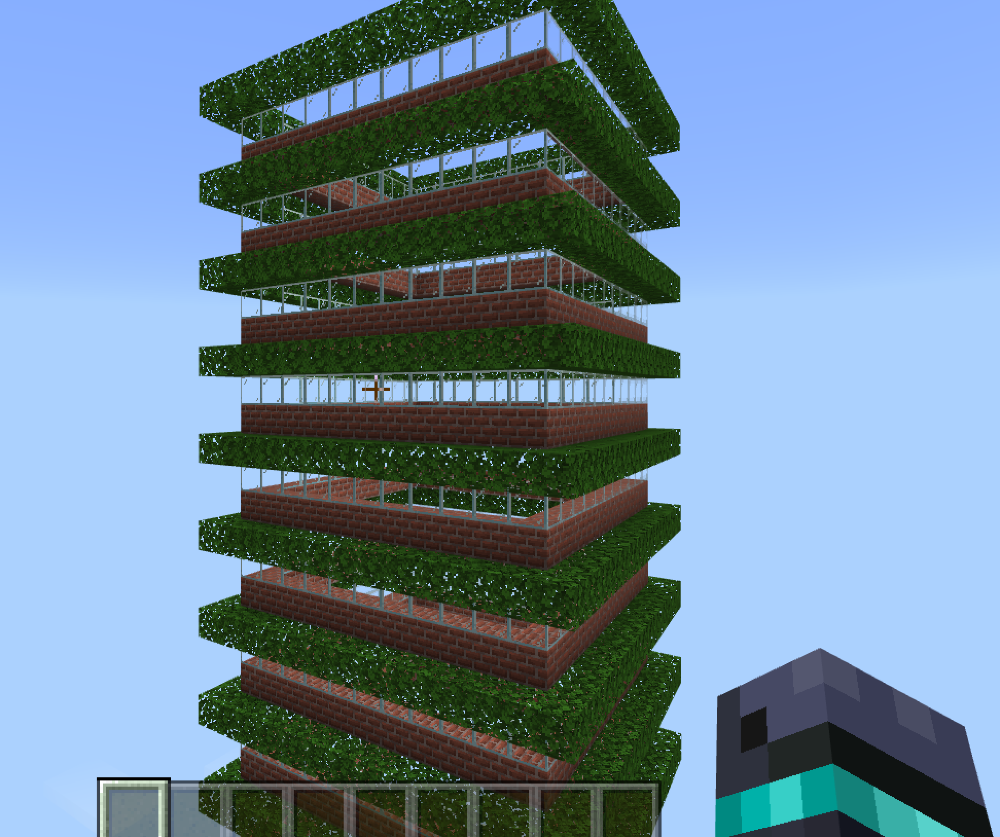

# Junior Engineers with Tony
{: .no_toc }

  

    Table of contents
  

  {: .text-delta }
1. TOC
{:toc}

---

## Enter the Kahoot quiz
Click on the button below to open **Kahoot** in a new tab.

<a href="https://kahoot.it" target="_blank"><button class="btn btn-purple">Open Kahoot</button></a>

{: .did-you-know}
Someone always asks what the game pin is, even though it's up on the screen.

---

## Sign in to Minecraft Education
Click your name to automagically copy your username.

  <button class="btn mr-4 mb-4" id="instructor10">Tony</button>
  <button class="btn mr-4 mb-4" id="junior142">Amir</button>
  <button class="btn mr-4 mb-4" id="junior143">Benny</button>
  <button class="btn mr-4 mb-4" id="junior144">Andrew</button>

{: .selected-user}

None

If your name appears above, your username has been copied. Just right-click and paste into **Minecraft Education**.

{: .did-you-know}
The shortcut for paste is **Control + V**

What's the password? Check the whiteboard ~~or ask an instructor~~!

---

~~## Last Week's Code
This is the code we finished last week in *Python*. If you need to catch up, you can copy the *Python* code into the **Minecraft Code Builder**.

{: .did-you-know}
You can convert the code from *Python* to *Blocks* by clicking on the 🧩 in the **Code Builder**. Try converting it above!~~

---

## Today's Activity
We’re going to be building skyrises in the Code Builder!

### Challenge 1 (Medium)
Make your skyscraper eco-friendly by adding a layer of oak leaves for each story.

### Challenge 2 (Hard)
Make the oak leaves grow one block out from the skyscraper on all sides.

